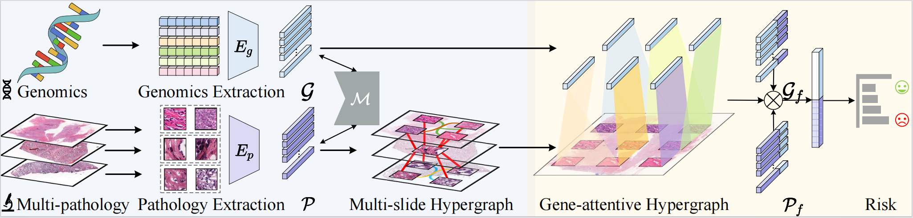

MRePath
===========

<details>
<summary>
  <b>Memory-Augmented Incomplete Multimodal Survival Prediction via Cross-Slide and Gene-Attentive Hypergraph Learning</b>, MICCAI 2025.
  <a href="https://arxiv.org/pdf/2506.19324" target="blank">[arxiv]</a>
  <br><em>Mingcheng Qu, Guang Yang, Donglin Di, Yue Gao, Tonghua Su, Yang Song, Lei Fan*</em></br>
</summary>


</details>

**Summary:** We propose a multimodal learning framework, M²Surv (Memory-Augmented Multimodal Framework for Survival Prediction) to integrate multiple pathology slides and genomic data while addressing the pathology-genomics imbalance through hypergraph learning. Additionally, a memory bank is introduced to store paired pathology-genomic features during training, allowing the retrieval of relevant features to compensate for incomplete modalities during inference.



### Downloading TCGA Data
To download diagnostic FF and FFPE slides (formatted as .svs files), molecular feature data and other clinical metadata, please refer to the [NIH Genomic Data Commons Data Portal](https://portal.gdc.cancer.gov/) and the [cBioPortal](https://www.cbioportal.org/). WSIs for each cancer type can be downloaded using the [GDC Data Transfer Tool](https://docs.gdc.cancer.gov/Data_Transfer_Tool/Users_Guide/Data_Download_and_Upload/). Specifically, "DX" indicates FFPE slides, whereas "TS" or "BS" indicates FF slides.

## Installation Guide for Linux (using anaconda)

### Pre-requisites:
* Linux (Tested on Ubuntu 22.04) 
* NVIDIA GPU (Tested on Nvidia GeForce RTX 4090 Ti) with CUDA 12.1
* Python (3.10.7)


## Processing Whole Slide Images
To process WSIs, first, the tissue regions in each biopsy slide are segmented using Otsu's Segmentation on a downsampled WSI using OpenSlide. The 256 x 256 patches without spatial overlapping are extracted from the segmented tissue regions at the desired magnification. Consequently, a pretrained truncated ResNet50 is used to encode raw image patches into 1024-dim feature vectors, which we then save as .pt files for each WSI. The extracted features then serve as input (in a .pt file) to the network. The following folder structure is assumed for the extracted features vectors:    
```bash
DATA_ROOT_DIR/
    └──TCGA_BLCA/
        └──pt_files
            ├── slide_1.pt
            ├── slide_2.pt
            └── ...
    └──TCGA_BRCA/
        └──pt_files
            ├── slide_1.pt
            ├── slide_2.pt
            └── ...
    └──TCGA_COADREAD/
        └──pt_files
            ├── slide_1.pt
            ├── slide_2.pt
            └── ...
    └──TCGA_HNSC/
        └──pt_files
            ├── slide_1.pt
            ├── slide_2.pt
            └── ...
    └──TCGA_STAD/
        └──pt_files
            ├── slide_1.pt
            ├── slide_2.pt
            └── ...
    ...
```
DATA_ROOT_DIR is the base directory of all datasets / cancer type(e.g. the directory to your SSD). Within DATA_ROOT_DIR, each folder contains a list of .pt files for that dataset / cancer type.


## Molecular Features and Genomic Signatures
Processed molecular profile features containing mutation status, copy number variation, and RNA-Seq abundance can be downloaded from the [cBioPortal](https://www.cbioportal.org/), which we include as CSV files in the [following directory](https://github.com/iccv2021anon/10972/tree/master/datasets_csv_sig). For ordering gene features into gene embeddings, we used the following categorization of gene families (categorized via common features such as homology or biochemical activity) from [MSigDB](https://www.gsea-msigdb.org/gsea/msigdb/gene_families.jsp?ex=1). Gene sets for homeodomain proteins and translocated cancer genes were not used due to overlap with transcription factors and oncogenes respectively. The curation of "genomic signatures" can be modified to curate genomic embedding that reflect unique biological functions.

## Training-Validation Splits 
For evaluating the algorithm's performance, we  partitioned each dataset using 5-fold cross-validation (stratified by the site of histology slide collection). Splits for each cancer type are found in the [`splits`](https://github.com/MCPathology/MRePath/tree/main/splits/5folds) folder, which each contain **splits_{k}.csv** for k = 1 to 5. In each **splits_{k}.csv**, the first column corresponds to the TCGA Case IDs used for training, and the second column corresponds to the TCGA Case IDs used for validation. Slides from one case are not distributed across training and validation sets. Alternatively, one could define their own splits, however, the files would need to be defined in this format. The dataset loader for using these train-val splits are defined in the `return_splits` function in the `SurvivalDatasetFactory`.

## Running Experiments 
Refer to [`scripts`]([https://github.com/MCPathology/MRePath/tree/main/scripts](https://github.com/MCPathology/MRePath/tree/main/scripts)) folder for source files to train SurvPath and the baselines presented in the paper. Refer to the paper to find the hyperparameters required for training.

### Step 1: Generate WSI Graph Structures 
To initiate the graph-building process for WSI patches, you can use the following Python command. This approach involves first storing binary edges, which allows for random sampling and subsequently generating hyperedges based on these stored binary edges: 

``` shell
bash python extract_graph.py --ff_path FF_H5_PATH --ffpe_path FFPE H5_PATH --graph_save_path GRAPH_SAVE_PATH
```

`--ff_path`: This parameter specifies the path to FF HDF5 file containing WSI patch data processed by CLAM. Replace `FF_H5_PATH` with the actual path to your data file.

`--ffpe_path`: This parameter specifies the path to FFPE HDF5 file containing WSI patch data processed by CLAM. Replace `FFPE_H5_PATH` with the actual path to your data file.

`--graph_save_path GRAPH_SAVE_PATH`: This parameter defines where the generated graph structures will be saved. Replace `GRAPH_SAVE_PATH` with your desired output directory or file path. 

After hypergraph structure built, the file structure can be viewed as follows:
```bash
DATA_ROOT_DIR/
    └──TCGA_BLCA/
        └──graph_files
            ├── case_1.pt
            ├── case_2.pt
            └── ...
    └──TCGA_BRCA/
        └──graph_files
            ├── case_1.pt
            ├── case_2.pt
            └── ...
    └──TCGA_COADREAD/
        └──graph_files
            ├── case_1.pt
            ├── case_2.pt
            └── ...
    └──TCGA_HNSC/
        └──graph_files
            ├── case_1.pt
            ├── case_2.pt
            └── ...
    └──TCGA_STAD/
        └──graph_files
            ├── case_1.pt
            ├── case_2.pt
            └── ...
    ...
```

For a quick start, you can also run the `graph.sh` script to generate WSI graph structures: 

``` shell
bash scripts/graph.sh
``` 

This script will automate the processing of your data and create graph structures suitable for training. Ensure that you check and adjust the parameter settings within the script as needed to ensure compatibility with your specific data format.

### Step 2: Start Model Training 
Next, use the `run.sh` script to start training the SurvPath model and other baseline models. 

``` shell 
bash scripts/run.sh
``` 

Before running this script, refer to the hyperparameter settings recommended in the paper, and adjust relevant configurations in the script according to your experimental needs. 

## Citation

```bibtex
@article{qu2025memory,
  title={Memory-Augmented Incomplete Multimodal Survival Prediction via Cross-Slide and Gene-Attentive Hypergraph Learning},
  author={Qu, Mingcheng and Yang, Guang and Di, Donglin and Gao, Yue and Su, Tonghua and Song, Yang and Fan, Lei},
  journal={arXiv preprint arXiv:2506.19324},
  year={2025}
}